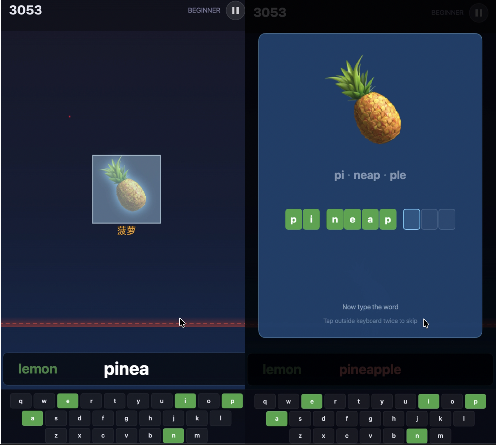

# WordDrop — Learn English by Playing

> An addictive English vocabulary game inspired by Tetris and AI reinforcement learning. No studying required — learn by doing.

**Play now:** https://hh-ricco.github.io/worddrop/



## How to Play

1. Choose a word pack
2. An image falls from the top of the screen — the word audio plays automatically
3. Type the word letter by letter before it reaches the bottom
4. Correct letter → green highlight + letter sound
5. Wrong letter → red flash + word audio replays — try again
6. The game remembers your progress and brings back words you struggled with

## Features

- **Multi-sensory**: Visual images + audio pronunciation + keyboard typing
- **SM-2 Spaced Repetition**: Words you miss come back quickly; mastered words appear less often
- **Multiple word packs**: By category (food, animals, transport...) or school grade
- **Custom packs**: Upload your own YAML word list or generate one with AI
- **PWA**: Install to desktop/phone, play offline
- **Learning records**: Track daily progress, streaks, and weak words
- **Multi-language**: Chinese, Japanese, Spanish, French translations

## Run Locally

```bash
# Clone the repo
git clone https://github.com/hh-ricco/worddrop.git
cd worddrop

# Start a local server (any of these work)
python3 -m http.server 8000
# or: npx serve .
# or: php -S localhost:8000

# Open in browser
open http://localhost:8000
```

No build step required. Open `index.html` through a local server (needed for YAML file loading).

## Word Pack Format

See [CONTRIBUTING.md](CONTRIBUTING.md) for the full YAML format and AI generation guide.

## Tech Stack

- HTML5 Canvas (game rendering)
- Vanilla JavaScript (no framework, no build tools)
- Web Speech API (text-to-speech)
- Howler.js (sound effects)
- js-yaml (YAML parsing)
- Giphy API (automatic GIF fetching, optional)
- localStorage (progress & settings)
- Service Worker (PWA offline support)

## License

MIT — see [LICENSE](LICENSE)
